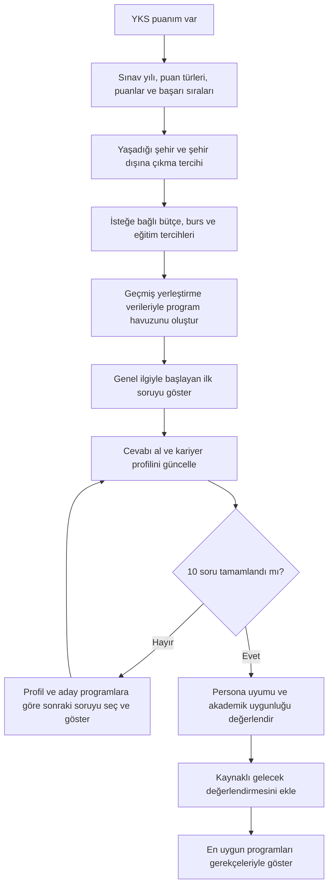
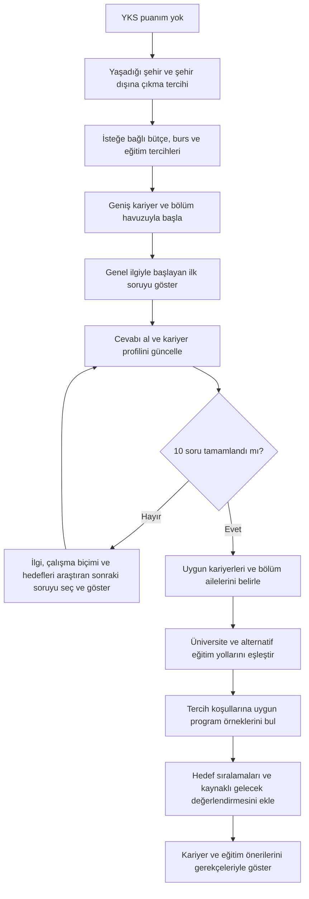
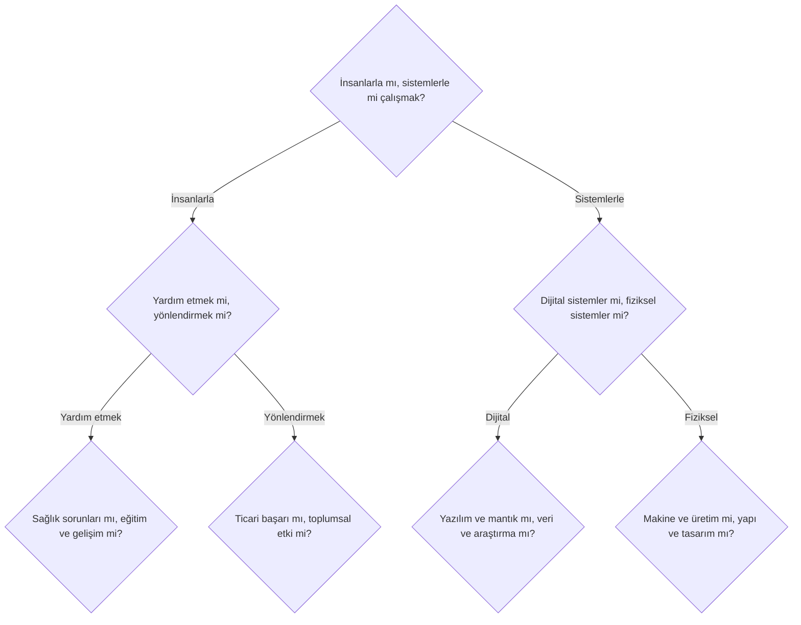
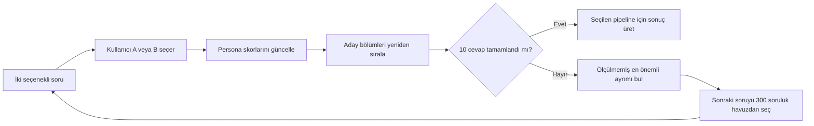

# YKS Persona ve Bölüm Öneri Pipeline'ları

**Durum:** İki ürün akışı onaylandı; teknik puanlama modeli ayrıca doğrulanacak.

**Tarih:** 12 Eylül 2026

## Amaç

OverFit, kullanıcının yalnızca YKS sonucuna göre tercih listesi oluşturan bir tercih robotu değildir. Kullanıcının mesleki ilgi alanlarını, çalışma biçimini, değerlerini ve gelecek beklentilerini 10 soruluk adaptif bir testle anlamayı; bu profili güncel üniversite verileriyle birleştirerek açıklanabilir bölüm önerileri üretmeyi amaçlar.

Ürün iki kullanıcı yolunu destekler:

1. **YKS puanım var:** Sıralama ve tercih koşullarına uygun programlar, persona uyumuyla birlikte değerlendirilir.
2. **YKS puanım yok:** Geniş kariyer keşfi yapılır; kariyerler, bölümler, alternatif eğitim yolları ve uygun programlar için hedef başarı sıraları gösterilir.

Her girişin bağımsız başlangıcı, soru seçimi bağlamı ve sonuç ekranı vardır. Kullanıcı seçtiği pipeline boyunca ilerler; YKS durumu tekrar sorulmaz. Soru havuzu ve hesaplama bileşenleri paylaşılabilir.

Kullanıcının sınıf seviyesi ana akışı değiştirmez.

## Temel ilkeler

- Kullanıcı toplam 10 persona sorusu cevaplar.
- YKS sonucu, şehir ve tercih koşulları 10 persona sorusunun dışında alınır.
- Her soruda iki cevap seçeneği bulunur.
- Her cevap, bir sonraki sorunun seçimini etkiler.
- Sorular sabit bir sırayla gösterilmez.
- Sistem için 300 soruluk etiketli bir havuz planlanmıştır; sorular kullanıma alınmadan önce gözden geçirilir.
- Tek bir cevap bir bölümü kesin olarak elemez; uyum ağırlığını değiştirir.
- Akademik eşikler ve kullanıcının açık kısıtları kesin filtre olabilir.
- AI yeni test sorusu üretmez; onaylı havuzdan seçim yapılır.
- AI, gelecek analizini ve öneri gerekçelerini anlaşılır dille açıklar.
- Eksik veya doğrulanmamış veri gerçekmiş gibi sunulmaz.
- Öneriler kesin yerleşme veya kariyer başarısı garantisi vermez.

## Başlangıç ekranı

YKS durumu bir anket sorusu olarak gösterilmez. Ana ekranda iki ayrı buton bulunur.

**Başlık**

> Sana uygun bölümü birlikte bulalım

**Açıklama**

> YKS durumunu seç, 10 soruyu cevapla ve sana uygun bölümleri keşfet.

**Butonlar**

- `YKS puanım var`
- `YKS puanım yok`

Her buton aşağıda ayrı belgelenen pipeline'ı başlatır. Kullanıcıya birleşik bir akış gösterilmez.

## Şehir ve tercih koşulları

Şehir ve eğitim tercihleri her iki kullanıcı yolunda 10 soruluk persona testinden önce alınır. Bu bilgiler öğrencinin kişiliğini ölçmez; hangi programların uygulanabilir olduğunu belirler. Bu nedenle 10 soruya dahil edilmez.

### Alınacak bilgiler

1. **Şu anda hangi şehirde yaşıyorsun?** Kullanıcı şehrini aranabilir listeden seçer. Konum izni zorunlu değildir.
2. **Üniversite için başka bir şehre taşınmayı düşünür müsün?**
   - Evet, düşünebilirim
   - Hayır, yaşadığım şehirde kalmak istiyorum
3. Kullanıcı taşınabileceğini belirtirse değerlendirmek istediği şehirleri seçebilir veya Türkiye genelini değerlendirebilir.
4. Kullanıcı isterse devlet/vakıf üniversitesi, yıllık eğitim bütçesi, burs gereksinimi, eğitim dili ve öğretim türü tercihlerini ekleyebilir.

### Filtre davranışı

- “Yaşadığım şehirde kalmak istiyorum” cevabı şehir için kesin filtre oluşturur.
- “Taşınabilirim” cevabında şehirler varsayılan olarak sıralama tercihi olur; kullanıcı belirli şehirleri kesin filtre olarak işaretleyebilir.
- Bütçe ve burs koşulları kullanıcı tarafından kesin sınır olarak belirtildiyse bu sınırı aşan programlar gösterilmez.
- Eğitim dili, üniversite türü ve öğretim türü varsayılan olarak sıralama sinyalidir; kullanıcı bunları kesin filtreye dönüştürebilir.
- Filtreler hiç sonuç bırakmazsa sistem sessizce boş ekran göstermez. Sonucu engelleyen koşulları açıklar ve kullanıcının filtreleri değiştirmesine izin verir.
- Kullanıcı sonuç ekranında tercih koşullarını değiştirerek önerileri yeniden hesaplayabilir.

## Pipeline 1 — YKS puanım var

Amaç: Kullanıcının sıralamasına ve tercihlerine göre değerlendirilebilecek programlar arasından ilgi ve çalışma beklentilerine uygun seçenekleri bulmak.

### Sonuç girişleri

Kullanıcı sınav yılını ve sonuç belgesindeki mevcut puan türleri için puan ve başarı sırasını girer:

- TYT
- SAY
- EA
- SÖZ
- DİL

Her puan türü ayrı saklanır. Uygunluk hesabında başarı sırası ana karşılaştırma ölçütü, puan ise destekleyici bilgidir. Bu girişler 10 persona sorusuna dahil değildir.

### Başlangıç program havuzu

Sistem son üç yerleştirme yılının ÖSYM ve YÖK Atlas verilerini kullanarak programları üç gruba ayırır:

- **Güvenli:** Geçmiş eşiklere göre kullanıcının sıralamasının belirgin biçimde yeterli olduğu programlar.
- **Hedef:** Geçmiş eşiklerin kullanıcının sıralamasına yakın olduğu programlar.
- **İddialı:** Daha iyi sıralama istemiş ancak makul tercih senaryosunda değerlendirilebilecek programlar.

Yıllar arasındaki oynaklık hesaba katılır ve kesin yerleşme garantisi üretilmez. Bu etiketlerin eşikleri geçmiş dönemlerle doğrulanmadan kesin olasılık gibi gösterilmez. Geçmiş taban sıraları tek başına kesin eleme koşulu değildir.

Akademik erişilebilirlik ve kariyer ilgisi ayrı tutulur. Sıralama veya şehir kısıtı persona puanını doğrudan değiştirmez; somut program seçeneklerini etkiler.

### Soru pipeline'ı



Sorular genel ilgiden başlar; önceki cevapların tamamına göre ilerler ve aday programları ayırmaya odaklanır. Örneğin kullanıcının sıralaması hem hemşirelik hem bilgisayar mühendisliği programlarına yetiyorsa şu soru gösterilebilir:

> **Yoğun bir iş gününde hangisi sana daha uygun gelir?**
>
> - A) İnsanlarla doğrudan ilgilenmek
> - B) Teknik bir sistem üzerinde çalışmak

A cevabı insan teması, B cevabı teknik çalışma tercihine ilişkin sinyal üretir. Tek başına sağlık veya mühendislik kararı vermez; diğer kariyer ailelerini tamamen kapatmaz.

### Öneri skoru

Akademik uygunluk, persona uyumu, tercih koşulları ve gelecek değerlendirmesi ayrı açıklanır. Önceki sürümdeki %40/%35 gibi ağırlıklar doğrulanmış bir model değildir; nihai oranlar olarak kullanılmaz. Sıralama ağırlıkları teknik model ve değerlendirme çalışmasında belirlenecektir.

### Sonuç ekranı

En fazla beş ana program önerisi ve uygun alternatifler için şunlar gösterilir:

- Üniversite, bölüm, şehir ve eğitim koşulları
- Güvenli, hedef veya iddialı etiketi
- Persona uyumunu destekleyen cevaplar
- Son üç yılın başarı sırası ve puan değişimi
- Önerilme gerekçesi
- Kullanıcıyla uyuşmayabilecek yönler
- Tipik eğitim ve çalışma biçimi
- Bölümden ilerlenebilecek kariyer yolları
- Gelecek potansiyeli ve dayandığı veriler
- Verinin yılı ve kaynağı

## Pipeline 2 — YKS puanım yok

Amaç: Kullanıcının ilgi ve beklentilerini keşfetmek; geleceğini şekillendirebileceği kariyerleri, bölümleri ve eğitim yollarını göstermek. Puan veya tahmini net girişi bu akışın ön koşulu değildir.

### Başlangıç program havuzu

Başlangıçta geniş kariyer ve bölüm aileleri değerlendirilir:

- Sağlık
- Mühendislik ve teknoloji
- Temel bilimler
- Sosyal bilimler
- Hukuk ve kamu
- Eğitim
- İşletme ve ekonomi
- İletişim
- Sanat ve tasarım
- Mimarlık ve yapı
- Tarım ve doğa
- Spor
- Dil
- Turizm ve hizmet
- Ön lisans ve teknik programlar

Müzisyenlik, ressamlık, girişimcilik veya yatırım alanında çalışma gibi hedefler de kariyer bağlamında ele alınır. Üniversite ve alternatif eğitim yolları ayrı tanımlanır.

Şehir ve bütçe somut eğitim seçeneklerini etkiler; öğrencinin kariyer ilgisini belirlemez. Örneğin şehirde bir müzik programı bulunmaması, müziğe ilgiyi profilinden silmez.

### Soru pipeline'ı



Örnek ilk dallanma:



Gerçek soru seçimi, kullanıcının tüm önceki cevaplarına ve henüz ölçülmemiş persona boyutlarına göre yapılır.

### Öneri skoru

Kariyer uyumu, eğitim beklentisi, tercih koşulları ve gelecek değerlendirmesi birlikte ele alınır. Önceki sürümdeki %55/%25 gibi ağırlıklar doğrulanmış bir model değildir; nihai oranlar teknik değerlendirmeyle belirlenecektir.

### Sonuç ekranı

- Kısa persona özeti
- Baskın ilgi ve çalışma biçimleri
- En fazla beş ana kariyer/bölüm önerisi
- Bu kariyerlere götüren üniversite ve alternatif eğitim yolları
- Tercih koşullarına uygun üniversite programlarından örnekler
- Başlamak için somut gelişim önerileri
- Her bölümün önerilme gerekçesi
- Kullanıcıyla uyuşmayabilecek yönler
- Tipik eğitim ve çalışma biçimi
- Gelecek potansiyeli
- Son üç yıl verilerine göre hedef başarı sırası aralığı
- Benzer ve alternatif bölümler

Üniversite gerektirmeyen veya farklı kabul süreçleri olan yollara yapay bir YKS sıralama hedefi atanmaz. Özel yetenek veya diğer kabul süreçleri ayrı açıklanır.

## Ortak adaptif döngü



Her cevaptan sonra sistem:

1. İlgili persona boyutlarını günceller.
2. Aday programların uyum skorlarını yeniden hesaplar.
3. Tekrarlanan veya artık bilgi sağlamayan soruları eler.
4. Kalan programları en iyi ayıracak soruyu seçer.
5. Aynı soru ailesinden arka arkaya soru göstermemeye çalışır.
6. Son adımda önceki çıkarımları farklı bir senaryoyla kontrol eder.

Onuncu soru, testin içindeki belirsizlik veya tutarlılık kontrolüdür; ayrıca on birinci soru sorulmaz. “Emin değilim” seçeneği bulunmaz, ancak A seçimi B'yi kesinlikle istememek anlamına gelmez.

İlk 1–3 soru genel ilgiye, 4–6 eğilimleri derinleştirirken alternatifleri araştırmaya, 7–9 yakın kariyerlerin günlük koşullarını ayırmaya odaklanır. Bunlar sabit soru metinleri değildir.

## Persona boyutları

Persona tek bir meslek etiketi değil, aşağıdaki boyutların sayısal birleşimidir:

- İnsan, sistem, veri, fikir ve fiziksel nesne odağı
- Uygulamalı çalışma eğilimi
- Araştırma ve analiz eğilimi
- Sanatsal ve yaratıcı üretim eğilimi
- Sosyal yardım ve eğitim eğilimi
- Girişimcilik, ikna ve liderlik eğilimi
- Düzen, detay ve süreç eğilimi
- Bağımsız veya ekip içinde çalışma tercihi
- Masa başı veya hareketli çalışma tercihi
- Belirlilik veya değişkenlik tercihi
- Güvence, gelir, anlam, tanınma, ilişki ve bağımsızlık değerleri
- Teorik veya uygulamalı öğrenme tercihi
- Uzun eğitim sürecine ve mesleki sorumluluğa yaklaşım

Yapı, mesleki ilgi için RIASEC yaklaşımından ve iş değerleri çerçevelerinden yararlanır; Türkiye'deki program ve çalışma koşullarına göre uyarlanır.

Eşleştirme sırası: **Kullanıcı profili → kariyerler → eğitim yolları → üniversite programları**. Meslek, bölüm ve somut üniversite programı ayrı kavramlardır.

On cevap bütün boyutların yeterince ölçüldüğü anlamına gelmez. Cevaplarla desteklenen çıkarımlar ve ölçülmemiş yönler sonuçta ayrılır. İlgi soruları ölçülmüş yetenek veya kesin kişilik teşhisi gibi sunulmaz; doğrulanmamış güven yüzdesi gösterilmez.

## 300 soruluk havuz

| Soru grubu | Adet |
|---|---:|
| Ortak mesleki ilgi soruları | 60 |
| Çalışma ortamı ve günlük yaşam | 35 |
| Problem çözme ve düşünme biçimi | 30 |
| İnsan ilişkileri ve iletişim | 25 |
| Kariyer değerleri ve beklentiler | 20 |
| Ortak tutarlılık soruları | 10 |
| YKS sonucu olmayana özel alan keşfi | 25 |
| YKS sonucu olmayana özel öğrenme ve eğitim tercihi | 15 |
| YKS sonucu olmayana özel gelecek hedefleri | 10 |
| YKS sonucu olmayana özel doğrulama | 10 |
| YKS sonucu olana özel erişilebilir bölüm karşılaştırması | 25 |
| YKS sonucu olana özel meslek yaşamı gerçekliği | 15 |
| YKS sonucu olana özel risk ve hedef dengesi | 10 |
| YKS sonucu olana özel tercih ayrıştırma | 10 |
| **Toplam** | **300** |

Yaklaşık 180 soru iki kullanıcı yolunda ortak, 60 soru YKS sonucu olmayanlara özel ve 60 soru YKS sonucu olanlara özeldir.

## Soru veri modeli

Her soru en az şu alanlara sahip olur:

```yaml
id: string
text: string
option_a:
  text: string
  score_effects: object
option_b:
  text: string
  score_effects: object
audience: both | score_known | score_unknown
dimensions: string[]
program_families: string[]
prerequisites: object
exclusions: object
question_family: string
reverse_pair_id: string | null
priority: number
version: number
status: draft | reviewed | active | retired
```

`score_effects`, seçeneğin persona boyutlarını nasıl değiştirdiğini belirtir. `prerequisites`, sorunun hangi koşullardan sonra gösterilebileceğini tanımlar. `question_family`, benzer soruların aynı oturumda tekrarını engeller. `reverse_pair_id`, tutarlılık kontrolünde kullanılabilecek karşıt soruyu gösterir.

## Soru seçme yöntemi

Bir sonraki soru şu sinyallerle seçilir:

1. Kalan aday bölümleri ne kadar iyi ayırdığı
2. Henüz yeterince ölçülmemiş persona boyutları
3. Önceki cevapların oluşturduğu yol koşulları
4. Aynı soru ailesinin tekrar edilmemesi
5. Kullanıcının YKS sonucunun bulunup bulunmaması
6. Son sorularda sonuç güvenini artırma ihtiyacı

Soru seçimi deterministik kurallar ve sayısal skorlarla yapılır. Aynı girdiler açıklanabilir ve tutarlı bir yol üretmelidir. Büyük dil modeli temel puanlama kurallarının yerine geçmez.

Eşitlikte sabit öncelik, ardından soru kimliği kullanılır. Uygun özel soru kalmazsa ortak havuzdan tekrar etmeyen genel soru seçilir. Her iki akışın 10 adımı tamamlayabilmesi soru bankasının yayımlanma koşuludur. Seçim formülü ve boyut ağırlıkları ayrıca tanımlanıp doğrulanacaktır.

## Arayüz davranışları

- Puanı olan kullanıcı önce sınav sonuçlarını, ardından tercih koşullarını girer. Puanı olmayan kullanıcı doğrudan tercih koşullarıyla başlar.
- Şehir alanı aranabilir bir liste kullanır ve konum izni istemez.
- Kesin filtreler ile sıralamayı etkileyen tercihler arayüzde açıkça ayrılır.
- Her ekranda tek soru gösterilir.
- İki cevap eşit öneme sahip seçim kartlarıdır.
- İlerleme `3 / 10` biçiminde görünür.
- Kullanıcı önceki soruya dönebilir.
- Önceki cevap değişirse sonraki soru yolu yeniden hesaplanır.
- Geçersiz kalan eski cevaplar sonuç hesabında kullanılmaz.
- Şehir veya bütçe değiştiğinde program önerileri yeniden hesaplanır; cevaplardan çıkarılmış ilgi profili korunur. Yeni koşullara özgü ölçülmemiş yönler ölçülmüş sayılmaz.
- Test yarıda kalırsa kullanıcı devam edebilir.
- Veri yüklenemezse yeniden deneme sunulur; uydurma sonuç gösterilmez.

## AI gelecek analizi

AI, bölümün geleceğini kaynağı ve tarihi belirli göstergelerle yorumlar:

- İstihdam ve iş ilanı eğilimleri
- Sektörel büyüme veya daralma
- Teknolojik değişimin mesleğe etkisi
- Otomasyon riski ve insan becerisi ihtiyacı
- Mezun arzı ve talep dengesi
- Ücret ve çalışma koşulları
- Bölgesel ve küresel hareketlilik
- Yeni uzmanlık alanları

Her yorumda veri yılı ve kaynak gösterilir. Olumlu sinyaller, riskler ve belirsizlikler ayrı açıklanır.

## Veri kaynakları

- Program kodu, puan, başarı sırası, kontenjan ve yerleştirme verilerinde ÖSYM'nin resmi dosyaları temel doğrulama kaynağıdır.
- YÖK Atlas program ve üniversite detaylarını zenginleştirir.
- Kaynaklar ham hâliyle arşivlenir ve normalize kayıtlar kaynağına kadar izlenebilir olur.
- Kaynaklar çelişirse değerler sessizce birleştirilmez; uyuşmazlık kaydedilir.
- Sonuç ekranında verinin yılı gösterilir.

## Hata ve uç durumlar

| Durum | Beklenen davranış |
|---|---|
| Yalnızca bir puan türü girilir | Yalnızca ilgili programlar akademik açıdan değerlendirilir. |
| Puan var, başarı sırası yok | Sonuç tamamlanmadan başarı sırası istenir. |
| Geçmiş yıl verisi eksik | Eksik yıl belirtilir ve güven seviyesi düşürülür. |
| Cevaplar çelişir | Son adımlardan biri çelişkiyi farklı senaryoyla kontrol eder. |
| İki alan eşit çıkar | İki güçlü yön birlikte gösterilir; kullanıcı tek tipe zorlanmaz. |
| Beşten az uygun sonuç vardır | İlgisiz önerilerle liste tamamlanmaz; mevcut seçenekler gösterilir. |
| Gelecek analizi verisi yoktur | Profil ve doğrulanmış program bilgileri gösterilir; analiz eksikliği açıklanır. |
| Kullanıcı şehir dışında okumak istemez | Yalnızca yaşadığı şehirdeki programlar değerlendirilir. |
| Kullanıcı Türkiye genelini değerlendirir | Şehir kesin filtre olmaz; diğer uyum sinyalleri öncelik kazanır. |
| Hiçbir program açık kısıtları karşılamaz | Etkili kısıtlar açıklanır ve değiştirilebilir filtreler gösterilir. |
| Veri kaynağı erişilemez | Son doğrulanmış veri tarihi gösterilir veya sonuç üretimi durdurulur. |
| Önceki cevap değiştirilir | O noktadan sonraki yol yeniden oluşturulur. |

## Başarı ölçütleri

- Testi tamamlama oranı
- Soru başına cevaplama süresi
- Cevap değiştirme oranı
- Sonuç güven skoru
- Önerilen bölümlerin kaydedilme ve karşılaştırılma oranı
- Kullanıcının önerileri faydalı bulma değerlendirmesi
- Tekrar testlerinde profil tutarlılığı
- Belirli alanların sistematik biçimde fazla veya az önerilmesi

Soru ağırlıkları gerçek kullanım verileri ve uzman değerlendirmeleriyle sürümlenir. Eski sonuçların hangi soru ve model sürümüyle üretildiği saklanır.

## Kabul kriterleri

- Başlangıç ekranında “YKS puanım var” ve “YKS puanım yok” girişleri bulunmalıdır.
- Her girişin ayrı başlangıcı, soru seçimi bağlamı ve sonuç ekranı olmalıdır.
- Kullanıcıya ayrıca “YKS sonucun belli mi?” sorusu sorulmamalıdır.
- Şehir ve tercih koşulları her iki kullanıcı yolunda persona testinden önce alınmalıdır.
- Şehir ve tercih koşulları 10 persona sorusuna dahil edilmemelidir.
- Şehir dışında okumak istemeyen kullanıcı için yaşadığı şehir kesin filtre olmalıdır.
- Kullanıcı tercih koşullarını değiştirerek önerileri yeniden hesaplayabilmelidir.
- Her iki yol da tam olarak 10 adaptif soru göstermelidir.
- Her soruda iki cevap seçeneği bulunmalıdır.
- Her cevap sonraki soruyu ve persona skorunu etkilemelidir.
- YKS sonucu belli kullanıcıda program havuzu akademik verilerle önceden daraltılmalıdır.
- YKS sonucu belli olmayan kullanıcıda tüm bölüm aileleri başlangıçta değerlendirilmelidir.
- Akademik sıralama, şehir ve bütçe doğrudan persona puanını değiştirmemelidir.
- Her iki soru döngüsü onuncu cevaptan sonra sonuca ulaşmalıdır.
- Önceki cevap değiştiğinde sonraki yol yeniden hesaplanmalıdır.
- Sonuçlarda gerekçeler, uyumsuzluk ihtimalleri, veri yılı ve kaynaklar gösterilmelidir.
- Eksik veri AI tarafından tahmin edilmemelidir.
- Aynı girişler açıklanabilir ve tutarlı sonuçlar üretmelidir.

## Kapsam sınırı

Bu belge adaptif soru ve öneri pipeline'ını tanımlar. Üç yüz sorunun nihai metinleri, meslek-program eşleştirme veri seti, veri toplama servisinin teknik uygulaması ve kullanıcı arayüzünün görsel tasarımı ayrı çalışma paketleridir.

Soru seçimi formülü, akademik uygunluk eşikleri, sıralama ağırlıkları ve on soruluk ölçümün kapsama/tutarlılık değerlendirmesi ayrıca tamamlanacaktır. Ürün akışının onaylanması, ölçüm modelinin doğrulandığı veya uygulamanın hazır olduğu anlamına gelmez.
